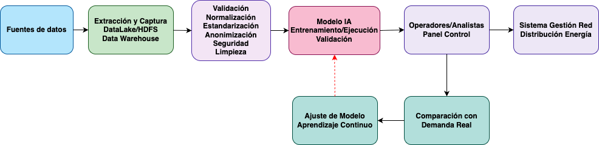

# Proyecto 1: Procesamiento del Dato y Gestión de Requisitos

## Contexto del Proyecto

EnergiTech quiere implementar un nuevo sistema de análisis predictivo basado en técnicas de inteligencia artificial para la gestión de la demanda energética, especialmente para garantizar la satisfacción de las necesidades de los clientes más críticos.

## Descripción del Proceso de Negocio que implica el cálculo de la previsión de la demanda energética

El proceso de negocio para la previsión de la demanda energética abarca desde la captura de señales en campo de las diferentes fuentes de energía renovable, datos de agentes externos que afectan tanto a la producción como a la demanda de energía, tratamiento de los datos para su limpieza, filtrado y validación, desarrollo de modelos de datos basados en IA para  la toma de decisiones y validación de resultados. A continuación, se detalla el modelo de proceso y las instrucciones de procesamiento:

- **Extracción y Captura**: El proceso comienza con la extracción de datos históricos de consumo desde el CRM y contadores de medida, datos de producción de las diferentes plantas de energía renovable, datos externos climatológicos, calendarios laborales en zonas de suministro, previsiones de mantenimiento en plantas, disponibilidad de equipos de reparación ante emergencias de producción.

- **Validación Inicial**: La empresa debe contar con sistemas automáticos supervisados para verificar que los registros obtenidos de las diferentes fuentes, sobre todo los esenciales, estén siempre disponibles y superen las reglas de calidad impuestas.

- **Tratamiento de datos**: Normalización de fuentes, los datos de distintas regiones y formatos se estandarizan y adecúan al sistema, anonimización aplicando máscaras a los datos sensibles de los clientes y productores y limpieza de los datos erróneos.

- **Entrenamiento y Ejecución del Modelo Predictivo**: Lanzamiento del motor predictivo (IA) introduciendo los parámetros de ventana temporal requerida.

- **Validación de Resultados**: Comprobar si el resultado tiene sentido antes de su aplicación y comparación de previsión con demanda real para ajustar el modelo.

- **Publicación de Previsión**: El resultado se vuelca al sistema de gestión de red para evitar cortes de suministro.

- **Ajuste y retroalimentación**: Comparación de previsión con demanda real para ajustar el modelo.

#### Datos de Entrada y Salida por Actividad del Proceso

Para cada actividad del proceso de negocio se identifican los datos concretos que consume (entrada) y los que produce (salida):

| Actividad | Datos de Entrada | Datos de Salida | 
|---|---|---|
| **Extracción y Captura** | Señales de contadores de medida, datos SCADA de producción de plantas, datos CRM, lecturas de APIs meteorológicas, calendarios laborales, planes de mantenimiento, estado de equipos | Datos brutos en raw zone del Data Lake | 
| **Validación Inicial** | Datos brutos ingestados | Datos validados | 
| **Tratamiento de datos** | Datos validados | Datos normalizados, anonimizados y limpios | 
| **Entrenamiento y Ejecución del Modelo** | Datos procesados y normalizados | Modelo de demanda | 
| **Validación de Resultados** | Predicción de demanda y datos históricos de demanda real | Predicción validada (aprobada/rechazada), informe de desviación | 
| **Publicación de Previsión** | Predicción validada | Previsión publicada en sistema de gestión de red, dashboards, alertas a operadores | 
| **Ajuste y retroalimentación** | Demanda real registrada, predicción publicada | Parámetros del modelo actualizados, dataset de entrenamiento enriquecido | 

En definitiva, se trata de un proceso cíclico, alimentado por diferentes fuentes de datos, los cuales deben ser tratados antes de su procesado y utilización. Una vez obtenidos estos resultados se realimentará el sistema para acelerar su aprendizaje.

## Identificación de Requisitos de Datos

Identificación exhaustiva de los requisitos para el proceso de análisis predictivo de demanda energética, estructurados en tres capas: requisitos del proceso de negocio, requisitos de datos y requisitos de calidad.

### Requisitos del Proceso de Negocio

El análisis predictivo de la producción y demanda de energía renovable en un sistema en tiempo real es un proceso bastante complejo en el que intervienen gran cantidad de factores y es bastante propenso a la aparición de incidencias inesperadas que pueden provocar la necesidad de reajustes temporales. Entre los requisitos a tener en cuenta a la hora de desarrollar un sistema de esta naturaleza, podemos destacar:

- **[RP01] Precisión en la predicción**: Es aceptable una tolerancia de error máximo del 5% en la previsión de demanda.
- **[RP02] Marco Temporal**: Debe ser capaz de realizar predicciones para 24 horas, 48 horas y semanal.
- **[RP03] Posibilidad de Actualización**: El modelo puede ser reajustado y actualizado diariamente con los últimos resultados y los nuevos datos.
- **[RP04] Ámbito Geográfico**: Debe ser válido para cubrir todo el ámbito geográfico de los clientes y proveedores de energía.
- **[RP05] Accesibilidad**: El sistema debe ser accesible tanto para los operadores de red, analistas de demanda, sistemas automáticos de balanceo.
- **[RP06] Disponibilidad**: Es necesario ofrecer una elevada disponibilidad, un 99%.
- **[RP07] Tiempo de Respuesta**: Ejecución del modelo en menos de 5 minutos.
- **[RP08] Integración**: Conexión automática con sistema de gestión de red.
- **[RP09] Flexibilidad**: Posible adaptación a nuevos operadores de red y a nuevas demandas de clientes.

### Requisitos de Datos

Como en todo sistema basado en datos, la calidad de los mismos suele ser un factor clave en el éxito final del proceso. Según la fuente, el tipo de dato y sus características, aplicaremos los siguientes requisitos:

| Fuente de Datos | Datos Requeridos | Formato | Frecuencia | Periodo Histórico | 
|---|---|---|---|---|
| **Contadores de medida** | Consumo (kWh), voltaje, intensidad | CSV/JSON, agregación 15 min | 15 minutos | 24 meses |
| **Contadores de producción** | Producción (kWh), voltaje, intensidad | CSV/JSON, agregación 15 min | 15 minutos | 24 meses |
| **CRM** | ID Cliente, tipo (VIP/Estándar), ubicación, contrato | CSV/Base Datos | Diario | Activo | Encriptar datos sensibles |
| **Plantas Renovables** | Producción (kWh), tipo energía (solar/eólica), temperatura equipos | Time-series, 15 min | 15 minutos | 24 meses |
| **Datos Climáticos Externos** | Temperatura, humedad, velocidad viento, radiación solar, precipitación | JSON API, horario | Horario | 24 meses |
| **Calendarios Laborales** | Festivos, fines de semana, periodos vacacionales por zona | CSV | Semestral | 12 meses adelante |
| **Mantenimiento Programado** | Fecha, planta, equipos afectados, duración prevista | CSV/Eventos | Ad-hoc | 3 meses |
| **Disponibilidad de Equipos** | Estado (disponible/unavailable), tipo, ubicación | Real-time / API | Real-time | N/A |

**Requisitos Específicos de Fuentes:**

- **[RD01] Contadores de medida:** completitud, identificador único, sello temporal.  
- **[RD02] Contadores de producción:** completitud, identificador único, sello temporal.
- **[RD03] CRM:** clasificación de clientes actualizada, coordenadas geográficas precisas, información de contrato actualizada.
- **[RD04] Plantas Renovables:** identificador único, identificacion de tipo de energía, capacidad nominal.
- **[RD05] Datos Climáticos:** alta disponibilidad, cobertura geográfica, datos históricos con mínimo 2 años.
- **[RD06] Calendarios y Eventos:** calendarios por zona de suministro, información de periodos vacacionales.
- **[RD07] Mantenimiento Programado:** calendarios por planta e información fechas y tiempo exacto de ejecución.
- **[RD08] Disponibilidad de Equipos:** calendarios de disponibilidad de equipos de mantenimiento, tiempo de respuesta, distancia a cada planta de producción.

### Requisitos de Calidad de Datos

En función de la naturaleza, origen y criticidad de los datos, aplicaremos una serie de requisitos de calidad:

- **[RCD01] Completitud**:
  - Contadores de medida: Mínimo 99% de registros diarios.
  - CRM: 100% de clientes activos con datos básicos.
  - Plantas Renovables: 99% de mediciones horarias.
  - Datos Climáticos: 95% disponibilidad.

- **[RCD02] Exactitud**:
  - Consumo eléctrico: ±2% respecto a medida estándar.
  - Producción energética: ±3% respecto a especificación técnica.
  - Coordenadas geográficas: Máximo error de 100 metros.
  - Temperaturas: ±1°C respecto a estación meteorológica oficial.

- **[RCD03] Consistencia**:
  - Consumo total de zona ≤ Producción total disponible.
  - Datos de cliente en CRM coinciden con identificador en Contador de medida.
  - Ubicación de cliente coherente con zona de suministro.
  - Permisos de acceso consistentes en los 3 últimos meses.

- **[RCD04] Exactitud de Marcas temporales**:
  - Contador de medida: Datos con máximo 30 minutos de retraso.
  - Plantas Renovables: Retraso máximo 15 minutos.
  - Datos Climáticos: Retraso máximo 1 hora.
  - Calendarios: Publicados con mínimo 3 meses de anticipación.

- **[RCD05] Unicidad**:
  - Sin registros duplicados en Contador de medida para un cliente y periodo.
  - Identificadores únicos en todas las tablas (clave primaria).
  - Sin clientes duplicados en CRM.

### Aspectos Específicos de Calidad y Gobierno

Todos los datos tratados dentro de nuestro proyecto cumplirán otros aspectos tanto legales como de calidad relacionados con el gobierno del dato, como:

**[RCG01] Anonimización y Cumplimiento GDPR**  
**[RCG02] Detección y Resolución de Duplicados**  
**[RCG03] Trazabilidad de Acceso a Datos**  
**[RCG04] Política de Retención de Datos**
