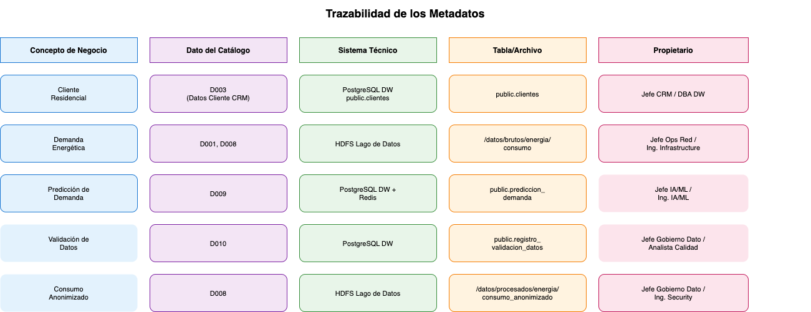
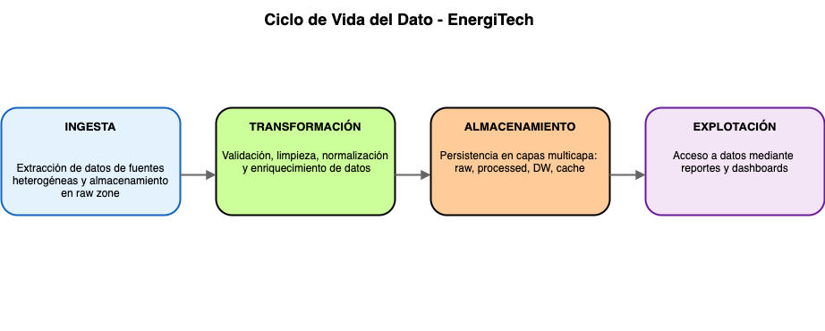
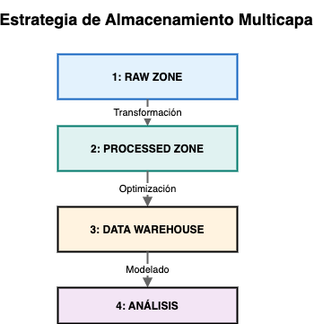

# Proyecto 2: Gestión de Metadatos y Ciclo de Vida del Dato

## 1. Introducción

En estos momentos, EnergiTech carece de un conocimiento democratizado sobre los datos que maneja en sus operaciones. Este proyecto aborda esta brecha mediante la creación de repositorios de metadatos alineados con la norma **UNE 0087** y el establecimiento de un ciclo de vida claramente definido para los datos del proceso de gestión de demanda energética.

## 2. Tarea 1: Creación de Repositorios de Metadatos

Los metadatos son fundamentales para garantizar que todos los trabajadores de la empresa que están en contacto con los datos compartan el mismo entendimiento de los datos. Implementaremos tres tipos de metadatos:

### 2.1. Metadatos de Negocio: Glosario de Términos

El glosario define qué significan los datos desde una perspectiva empresarial, facilitando la comunicación entre áreas técnicas y de negocio.

#### 2.1.1 Glosario de Términos - EnergiTech

El glosario completo está disponible en el servidor OpenMetadata en la dirección:

🔗 **[http://172.20.48.127:8585/glossary/%22Grupo01.Glosario%22](http://172.20.48.127:8585/glossary/%22Grupo01.Glosario%22)**

El glosario incluye términos de negocio (Demanda Energética, Cliente Residencial, etc.), requisitos (RPB, RD, RCD, RCG) y conceptos de gobernanza (Anonimización, Trazabilidad, Validación, etc.).

Dependiendo de la conexión, puede que el servidor OpenMetadata no esté disponible, por lo que se los datos del glosario se pueden consultar en formato CSV, compatible con OpenMetadata:

- **Archivo**: [`auxiliares/glosario-energitech-openmetadata.csv`](../auxiliares/glosario-energitech-openmetadata.csv)

#### 2.1.2 Propósito y Beneficios del Glosario

- **Comunicación Efectiva**: Elimina ambigüedades en la interpretación de conceptos clave
- **Onboarding**: Facilita la incorporación de nuevos empleados
- **Compliance**: Demuestra gobierno de datos en auditorías normativas
- **Alineación Organizacional**: Garantiza que toda la empresa comprenda la misma definición de cada término

### 2.2. Metadatos Técnicos: Catálogo de Datos

El catálogo de datos documenta para toda la información manejada en los procesos de negocio, dónde se encuentran almacenados los datos, su estructura física y su ubicación en sistemas técnicos.

#### 2.2.1 Catálogo de Datos - EnergiTech

**Resumen del Catálogo:**

| ID | Nombre | Fuente | Almacenamiento | Frecuencia | Volumen | Sensibilidad |
|----|--------|---------------|----|-----------|---------|---------------|
| **D001** | Consumo Cliente | Contadores inteligentes | HDFS Data Lake | 15 minutos | 500 GB/mes | PII.Sensitive |
| **D002** | Producción Planta | Sistemas SCADA | HDFS Data Lake | 15 minutos | 350 GB/mes | PII.NonSensitive |
| **D003** | Datos Cliente CRM | Salesforce CRM | PostgreSQL DW | Batch diario | 50 MB | PII.Sensitive |
| **D004** | Datos Climáticos | APIs meteorológicas | HDFS Data Lake | Horario | 100 GB/mes | PII.NonSensitive |
| **D005** | Calendarios Laborales | RR.HH. + Config | PostgreSQL DW | Semestral | 5 MB | PII.NonSensitive |
| **D006** | Mantenimiento Programado | Gestión de mantenimiento | PostgreSQL DW | Ad-hoc/Mensual | 10 MB | PII.NonSensitive |
| **D007** | Disponibilidad Equipos | CMDB | Service Management | PostgreSQL DW | 5 MB | PII.NonSensitive |
| **D008** | Consumo Anonimizado | Transformación de D001 | HDFS Data Lake | 15 minutos | 500 GB/mes | PII.Sensitive |
| **D009** | Predicción de Demanda | Modelo IA/ML | PostgreSQL + Redis | Post-modelo | 50 GB/mes | PII.NonSensitive |

En el siguiene documento adunto, se muestra la información del catálogo de datos en formato csv, que nos facilitará su publicación en OpenMetadata

- **Archivo**: [`auxiliares/catalogo-datos-energitech-openmetadata.csv`](../auxiliares/catalogo-datos-energitech-openmetadata.csv)

#### 2.2.2 Propiedades Ampliadas del Catálogo

Para cada dato se documenta:

- **Linaje de Datos**: Trazabilidad de transformaciones
- **Calidad Esperada**: Umbrales de completitud, exactitud, consistencia
- **SLA Técnico**: Disponibilidad esperada, RTO/RPO
- **Sensibilidad**: Clasificación de sensibilidad (público, interno, confidencial, secreto)
- **Ciclo de Vida**: Retención, archivado, eliminación
- **Cumplimiento**: Regulaciones aplicables (GDPR, sectorial)

### 2.3. Metadatos Operativos: Diccionario de Datos

El diccionario de datos documenta cómo se implementan técnicamente cada uno de los datos (campos, tipos, restricciones, transformaciones).

#### 2.3.1 Diccionario de Datos - Ejemplo: Consumo Cliente

**Tabla: `consumo`**  

| Campo | Tipo Dato | Nulabilidad | Restricciones | Descripción | Ejemplo | Transformaciones Aplicadas |
|-------|----------|-----------|----------------|-----------|---------|---------------------------|
| **meter_id** | STRING | NOT NULL | Clave primaria | Identificador único del contador (anonimizado con hash SHA-256) | a7f3c9e2d1b4 | Hash de ID original |
| **timestamp** | TIMESTAMP | NOT NULL | Índice temporal, precisión minuto | Marca temporal del registro con zona horaria UTC | 2024-04-10T14:30:00Z | Normalización a UTC desde zona local |
| **consumption_kwh** | DECIMAL(18,4) | NOT NULL | ≥ 0, ≤ 50,000 | Consumo de energía en kilovatios-hora | 12.3456 | Redondeo a 4 decimales |
| **voltage** | DECIMAL(6,2) | NULL | 180-250 V | Voltaje medido en vatios | 230.50 | Valores fuera de rango marcan como NULL |
| **intensity** | DECIMAL(8,4) | NULL | 0-80 A | Intensidad de corriente en amperios | 23.4500 | Captura de sensor o NULL si no disponible |
| **status** | STRING | NOT NULL | {'OK', 'ALERT', 'ERROR'} | Estado de la medición | OK | Reporte del contador o derivado de validación |
| **raw_received_at** | TIMESTAMP | NOT NULL | > timestamp | Timestamp de recepción en Data Lake | 2024-04-10T14:31:35Z | Registrado por sistema de ingesta |
| **data_partition_date** | DATE | NOT NULL | Clave de partición | Fecha para particionamiento Parquet (YYYY-MM-DD) | 2024-04-10 | Derivado del timestamp |

**Reglas de Validación en D001:**
1. `meter_id` no nulo y único por día
2. `timestamp` monótono creciente (sin saltos > 20 minutos)
3. `consumption_kwh` ≥ valor anterior (no puede decrecer en período corto)
4. `voltage` dentro de 180-250V; si fuera de rango = alerta
5. `consumption_kwh` o `intensity` deben estar presentes (no ambos NULL)

#### 2.3.2 Diccionario de Datos - Tabla Maestra: Consumo Anonimizado

**Tabla**: `consumo_anonymized`  

| Campo | Tipo Dato | Nulabilidad | Restricciones | Descripción | Transformación |
|-------|----------|-----------|----------------|-----------|-----------------|
| **customer_hash** | STRING | NOT NULL | Clave primaria | ID cliente anonimizado con hash SHA-256 irreversible | Hash SHA-256(ID original) |
| **consumption_period_date** | DATE | NOT NULL | Formato YYYY-MM-DD | Período de consumo (inicio de día) | Derivado de timestamp |
| **total_daily_consumption_kwh** | DECIMAL(15,2) | NOT NULL | ≥ 0 | Suma de consumo del día | SUM(consumption_kwh) agrupar por día |
| **avg_hourly_load_kw** | DECIMAL(10,4) | NOT NULL | ≥ 0 | Carga promedio horaria | AVG(consumption_kwh) en ventana 1h |
| **peak_load_kw** | DECIMAL(10,4) | NOT NULL | ≥ 0 | Pico máximo de carga en el día | MAX(intensity * voltage / 1000) |
| **availability_flag** | DECIMAL(5,2) | NOT NULL | 0-100 | Porcentaje de registros válidos en el día | COUNT(status='OK') / COUNT(*) * 100 |
| **quality_score** | DECIMAL(4,2) | NOT NULL | 0-1 | Score de calidad general: completitud × exactitud | (completitud × exactitud) / 100 |
| **processed_timestamp** | TIMESTAMP | NOT NULL | - | Cuándo se procesó el registro | CURRENT_TIMESTAMP |

### 2.4. Matriz de Trazabilidad: Relaciones entre Tipos de Metadatos

La **trazabilidad** de los datos conecta los tres tipos de metadatos asegurando consistencia y su linaje, en la siguiente figura se muestra la trazabilidad de diferentes elementos del catalogo de datos por filas, desde el concepto de negocio, fuente y soporte técnico del mismo, hasta el propietario o responsable del dato.

La siguiente tabla establece la relación entre los tres tipos de metadatos para cada dato. Para cada activo de datos se vincula: su definición de negocio (glosario), su ubicación técnica (catálogo) y su implementación física (diccionario):

| Dato | Metadato de Negocio (Glosario) | Metadato Técnico (Catálogo) | Metadato Operativo (Diccionario) |
|---|---|---|---|
| **Consumo Cliente** | Término: *Demanda Energética* — Cantidad de energía requerida por los clientes en un período determinado | Fuente: Contadores inteligentes — Almacenamiento: HDFS `/data/raw/energy/consumption` — Formato: CSV/Parquet, cada 15 min | Tabla: `consumo` — Campos: `meter_id` (STRING PK), `timestamp` (TIMESTAMP), `consumption_kwh` (DECIMAL), `voltage`, `intensity`, `status` |
| **Producción Planta** | Término: *Producción Renovable* — Energía generada a partir de fuentes renovables (solar, eólica, hidráulica, biomasa) | Fuente: Sistemas SCADA — Almacenamiento: HDFS `/data/raw/energy/production` — Formato: Time-series JSON, cada 15 min | Tabla: `produccion` — Campos: `plant_id` (STRING PK), `timestamp` (TIMESTAMP), `production_kwh` (DECIMAL), `energy_type`, `equipment_temp` |
| **Datos Cliente CRM** | Términos: *Cliente Residencial*, *Cliente VIP* — Clasificación de clientes según tipo de consumo y acuerdos contractuales | Fuente: CRM — Almacenamiento: PostgreSQL `public.customers` — Formato: Structured Data, batch diario | Tabla: `customers` — Campos: `customer_id` (STRING PK), `customer_type` (STRING), `location_lat` (DECIMAL), `location_lon` (DECIMAL), `contract_id` |
| **Datos Climáticos** | Término: *Datos Climáticos* — Variables meteorológicas: temperatura, humedad, viento, radiación, precipitación | Fuente: APIs meteorológicas — Almacenamiento: HDFS `/data/raw/weather` — Formato: JSON, cada hora | Tabla: `weather` — Campos: `station_id` (STRING PK), `timestamp` (TIMESTAMP), `temperature` (DECIMAL), `humidity`, `wind_speed`, `solar_radiation` |
| **Calendarios Laborales** | Término: *Calendarios Laborales* — Festivos, fines de semana y períodos vacacionales por zona | Fuente: RR.HH. + Config — Almacenamiento: PostgreSQL `public.calendars` — Formato: Structured Data, semestral | Tabla: `calendars` — Campos: `zone_id` (STRING PK), `date` (DATE PK), `day_type` (STRING), `is_holiday` (BOOLEAN) |
| **Mantenimiento Programado** | Término: *Mantenimiento Programado* — Fechas y duración de mantenimiento planificado en plantas | Fuente: Sistema gestión mantenimiento — Almacenamiento: PostgreSQL `public.maintenance_schedule` — Formato: Structured Data | Tabla: `maintenance_schedule` — Campos: `maintenance_id` (STRING PK), `plant_id` (STRING FK), `start_date` (TIMESTAMP), `duration_hours` (DECIMAL) |
| **Disponibilidad Equipos** | Término: *Disponibilidad de Equipos* — Estado y ubicación de equipos de reparación ante emergencias | Fuente: Sistema gestión mantenimiento — Almacenamiento: PostgreSQL — Formato: Structured Data, real-time | Tabla: `equipment_availability` — Campos: `equipment_id` (STRING PK), `status` (STRING), `type` (STRING), `location` (STRING) |
| **Consumo Anonimizado** | Términos: *Anonimización*, *Demanda Energética* — Datos de consumo con ID transformado mediante hash criptográfico irreversible | Fuente: Transformación post-validación de D001 — Almacenamiento: HDFS `/data/processed/energy/consumption_anonymized` — Formato: Parquet | Tabla: `consumo_anonymized` — Campos: `customer_hash` (STRING PK), `consumption_period_date` (DATE), `total_daily_consumption_kwh`, `avg_hourly_load_kw`, `quality_score` |
| **Predicción de Demanda** | Términos: *Análisis Predictivo*, *Ventana Temporal* — Previsión de demanda por ventana temporal (24h, 48h, 7d) | Fuente: Modelo IA/ML — Almacenamiento: PostgreSQL `public.demand_forecast` + Redis cache — Formato: JSON/Structured | Tabla: `demand_forecast` — Campos: `forecast_id` (STRING PK), `zone_id` (STRING FK), `forecast_window` (STRING), `predicted_kwh` (DECIMAL), `confidence` (DECIMAL) |

## 3. Tarea 2: Gestión del Ciclo de Vida del Dato

### Fases del Ciclo de Vida de Datos en EnergiTech

El ciclo de vida simplificado define cómo los datos se gestionan desde su origen hasta su explotación:

#### **Fase 1: INGESTA (Entrada del Dato)**

**Objetivo**: Capturar datos de fuentes heterogéneas de manera confiable y auditable

**Procesos:**
- Extracción de datos de fuentes (CRM, contadores inteligentes, APIs meteorológicas)
- Recepción y almacenamiento en "raw zone" del Data Lake

#### **Fase 2: TRANSFORMACIÓN (Procesamiento del Dato)**

**Objetivo**: Limpiar, validar, normalizar y enriquecer datos para uso analítico

**Procesos y Controles de Validación Detallados:**

**1. Validación de Datos (Reglas de Negocio)**

| Regla | Dato Afectado | Condición de Validación | Acción si Falla | Severidad |
|---|---|---|---|---|
| VAL-01 | Consumo  | `consumption_kwh >= 0 AND consumption_kwh <= 50000` | Rechazar registro, registrar en log de errores | Crítica |
| VAL-02 | Consumo | `timestamp` no nulo y sin saltos > 20 min respecto al anterior | Marcar como incompleto, notificar al Data Steward | Alta |
| VAL-03 | Consumo | `voltage` entre 180V y 250V | Marcar como `status = 'ALERT'`, mantener registro | Media |
| VAL-04 | Producción | `production_kwh >= 0 AND production_kwh <= capacidad_nominal_planta` | Rechazar registro, investigar anomalía | Crítica |
| VAL-05 | CRM | `customer_type IN ('VIP', 'Estándar', 'Industrial')` | Rechazar, solicitar corrección al equipo de CRM | Alta |
| VAL-06 | CRM | Coordenadas geográficas dentro del área de cobertura | Marcar para revisión manual | Media |
| VAL-07 | Climáticos | `temperatura BETWEEN -20 AND 55` (°C) | Descartar medición, usar interpolación temporal | Alta |
| VAL-08 | Todos | Registro no duplicado (clave primaria única por período) | Descartar duplicado, conservar el más reciente | Alta |

**2. Limpieza de Datos (Corrección/Eliminación de Anomalías)**

- Eliminación de registros que no superan las validaciones críticas (VAL-01, VAL-04)
- Imputación de valores faltantes en series temporales mediante interpolación lineal (máximo 2 registros consecutivos; si hay más, se marca como dato no disponible)
- Corrección de zonas horarias inconsistentes (normalización a UTC)

**3. Normalización (Estandarización de Formatos)**

- Unificación de formatos de timestamp a ISO 8601 (UTC)
- Conversión de unidades: toda energía expresada en kWh, temperaturas en °C
- Estandarización de códigos de zona geográfica según catálogo interno de EnergiTech

**4. Enriquecimiento (Cálculos Derivados)**

- Cálculo de `peak_load_kw` a partir de `intensity × voltage / 1000`
- Cálculo de `availability_flag` como porcentaje de registros válidos por día
- Cálculo de `quality_score` como producto de completitud × exactitud
- Unión con dimensiones: tipo de cliente (desde CRM), zona climática (desde Calendarios)

**5. Anonimización (Protección de Datos Personales)**

- Aplicación de hash SHA-256 irreversible sobre identificadores de cliente
- Supresión de campos con datos personales directos antes de paso a zona procesada
- Verificación de que ningún dato en la capa procesada permite re-identificación

#### **Fase 3: ALMACENAMIENTO (Persistencia del Dato)**

**Objetivo**: Mantener datos transformados accesibles y asegurados

**Estrategia de Almacenamiento Multicapa:**

#### **Fase 4: EXPLOTACIÓN (Uso del Dato)**

**Objetivo**: Poner datos a disposición de usuarios finales para análisis y toma de decisiones

**Métodos de Explotación:**

1. **BI Tools**
   - Herramienta: Tableau / Power BI
   - Dashboards: Predicción de demanda, análisis de consumo
   - Frecuencia: Real-time (actualización cada 15 min)
   - Usuarios: Jefes de operaciones, directivos

2. **Reportes Automáticos**
   - Reporte diario: Predicción vs. demanda real
   - Reporte semanal: Análisis de variaciones
   - Reporte mensual: Evaluación de calidad

### Políticas de Gobierno del Dato por Fase del Ciclo de Vida

Para regular qué se puede hacer y qué no se puede hacer con los datos en cada etapa, se definen las siguientes políticas:

#### Políticas de Ingesta

| ID | Política | Descripción |
|---|---|---|
| POL-ING-01 | Solo fuentes autorizadas | Únicamente se pueden ingestar datos de las fuentes registradas en el catálogo de datos. Cualquier nueva fuente requiere aprobación del Data Owner |
| POL-ING-02 | Registro de origen | Todo dato ingestado debe llevar metadatos de trazabilidad: fuente, timestamp de recepción y lote de carga |
| POL-ING-03 | Inmutabilidad de datos raw | Los datos recibidos en la raw zone no pueden ser modificados ni eliminados. Son la referencia de auditoría |
| POL-ING-04 | Monitorización de SLA | Se debe alertar automáticamente si una fuente no entrega datos dentro del SLA establecido (ej: contadores > 30 min de retraso) |

#### Políticas de Transformación

| ID | Política | Descripción |
|---|---|---|
| POL-TRA-01 | Validación obligatoria | Ningún dato puede pasar a la capa procesada sin superar las reglas de validación definidas |
| POL-TRA-02 | Trazabilidad de transformaciones | Toda transformación aplicada debe quedar registrada (qué regla, cuándo, resultado) para garantizar reproducibilidad |
| POL-TRA-03 | Anonimización antes de procesado | Los datos con información personal deben anonimizarse antes de cualquier otro procesamiento analítico |
| POL-TRA-04 | Prohibición de modificación manual | Las transformaciones deben ser automáticas y versionadas. No se permiten modificaciones manuales de datos en la capa de transformación |

#### Políticas de Almacenamiento

| ID | Política | Descripción |
|---|---|---|
| POL-ALM-01 | Cifrado obligatorio para PII | Todos los datos clasificados como PII.Sensitive deben almacenarse cifrados |
| POL-ALM-02 | Retención según tipo de dato | Contadores y climáticos: 24 meses. CRM: mientras el cliente esté activo. Logs de acceso: 24 meses. Superado el período, los datos deben archivarse o eliminarse |
| POL-ALM-03 | Segregación por sensibilidad | Los datos sensibles (PII) deben almacenarse en zonas separadas con controles de acceso diferenciados |
| POL-ALM-04 | Copias de seguridad | Backup diario de la capa procesada y semanal de la raw zone, con verificación de integridad |

#### Políticas de Explotación

| ID | Política | Descripción |
|---|---|---|
| POL-EXP-01 | Acceso basado en roles | El acceso a datos en explotación se otorga según el rol: operadores (dashboards operativos), analistas (datos agregados), directivos (reportes ejecutivos) |
| POL-EXP-02 | Prohibición de exportación de PII | No se permite la descarga ni exportación de datos con información personal identificable desde las herramientas de BI |
| POL-EXP-03 | Registro de acceso | Todo acceso a datos en explotación queda registrado en el sistema de auditoría (quién, qué dato, cuándo, con qué propósito) |
| POL-EXP-04 | Uso exclusivo para fines autorizados | Los datos solo pueden utilizarse para los fines descritos en el proceso de negocio. Cualquier uso secundario requiere aprobación del Data Owner y evaluación de impacto |
