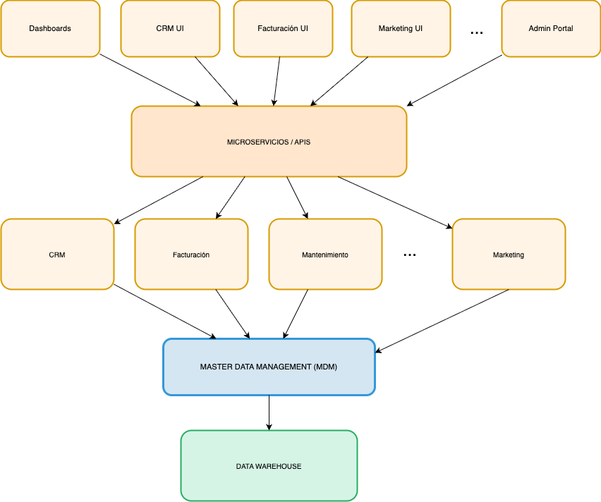

# Proyecto 3: Gestión de Datos Maestros y Arquitectura y diseño de Datos

## 1. Introducción

En este proyecto, además de los problemas identificados en los proyectos anteriores (falta de metadatos y ciclo de vida descontrolado), afrontaremos un desafío crítico en la gestión de datos: la existencia de **silos de datos no integrados**. Esta fragmentación provoca la duplicación de registros en múltiples sistemas, creando ambigüedad en la identificación de datos y generando desconfianza en su calidad.

Este proyecto aborda esta problemática mediante la creación de un **repositorio de datos maestros** (Master Data Management - MDM) que actúe como "fuente de verdad única" para la información de clientes, y propone una **arquitectura de datos escalable** que permita el intercambio controlado de información entre los repositorios operacionales y el repositorio maestro.

## 2. Identificación del Problema: Silos de Datos

### 2.1 Descripción

El análisis de los sistemas de información de EnergiTech revela los siguientes problemas:

#### **Duplicación de Clientes, Variabilidad en Formatos (Nombre, Dirección, Telefono, ...)**

| Servicio | ID Cliente | Nombre | Dirección | Email | Teléfono | Status |
|----------|-----------|--------|-----------|-------|----------|--------|
| Luz | CL-LUZ-0045 | Juan Pérez García | Calle Mayor 25, Apt 3B | juan.perez@mail.com | 912345678 | Activo |
| Gas | CL-GAS-0892 | Juan Perez Garcia | C/ Mayor 25 - 3B | j.perez@mail.com | 912345678 | Activo |
| Mantenimiento | CL-MANT-1203 | J. Pérez García | Mayor 25 Apto 3B | jperez@mail.com | +34 912 345 678 | Activo |

### 2.2 Impacto Empresarial

| Aspecto | Descripción | Impacto |
|--------|-----------|--------|
| **Operativo** | No se puede identificar el cliente real en cada interacción | Servicio al cliente degradado, facturación incorrecta |
| **Analítico** | El análisis de demanda por cliente es impreciso | Predicciones inexactas, decisiones estratégicas fallidas |
| **Financiero** | Ingresos no consolidados, duplicación de costos administrativos | Pérdida de eficiencia, mayor costo de gestión |
| **Regulatorio** | Dificultad en cumplimiento GDPR (derecho de olvido) | Riesgo de sanciones, vulnerabilidades en privacidad |
| **Estratégico** | No hay vista 360° del cliente | Imposible implementar estrategias de retención personalizadas |

---

## 3. Solución: Gestión de Datos Maestros (MDM)

### 3.1 Concepto de Datos Maestros

Los **datos maestros** son el conjunto de información de referencia que define las entidades clave de la organización (Clientes, Productos, Proveedores, etc.). Actúan como la "fuente de verdad única" desde la cual se replican datos a todos los sistemas operacionales.

Como ejemplo desarrollaremos el modelo de datos maestros para la entidad Cliente, una de las más utilizada y compartida por los diferentes procesos de la organización.

### 3.2 Modelo de Datos Maestros: Entidad Cliente

#### 3.2.1 Atributos Maestros para Cliente

El modelo maestro de Cliente incluye los siguientes atributos, organizados por categoría:

| Tipo de Atributo | Atributo | Tipo Dato | Nulabilidad | Descripción | Ejemplo | Fuente de Verdad |
|------------------|----------|----------|-----------|-----------|---------|-----------------|
| **Identificación** | **id_cliente_maestro** | STRING | NOT NULL | Identificador único | MC-0045892 | MDM |
| **Identificación** | **id_nacional** | STRING | NOT NULL | DNI | 12345678A | CRM (principal) |
| **Identificación** | **id_fiscal** | STRING | NULL | Número de Identificación Fiscal | ES12345678 | CRM (empresas) |
| **Contacto** | **primer_nombre** | STRING | NOT NULL | Primer nombre| Juan | CRM |
| **Contacto** | **apellido_1** | STRING | NOT NULL | Primer apellido | Pérez | CRM |
| **Contacto** | **apellido_2** | STRING | NULL | Segundo apellido | García | CRM |
| **Contacto** | **nombre_legal** | STRING | NOT NULL | Nombre completo | Juan Pérez García | CRM (derivado) |
| **Contacto** | **email_principal** | STRING | NOT NULL | Email de contacto principal | juan.perez@mail.com | CRM |
| **Contacto** | **email_secundario** | STRING | NULL | Email alternativo | jperez@empresa.com | CRM |
| **Contacto** | **telefono_principal** | STRING | NOT NULL | Teléfono de contacto | +34912345678 | CRM |
| **Contacto** | **telefono_secundario** | STRING | NULL | Teléfono alternativo | +34913456789 | CRM |
| **Ubicación** | **direccion_postal** | STRING | NOT NULL | Dirección postal completa | Calle Mayor 25, Apto 3B, 28001 Madrid | CRM |
| **Ubicación** | **codigo_postal** | STRING | NOT NULL | Código postal | 28001 | CRM |
| **Ubicación** | **ciudad** | STRING | NOT NULL | Municipio | Madrid | CRM |
| **Ubicación** | **comunidad_autonoma** | STRING | NOT NULL | Comunidad Autónoma | Madrid | CRM |
| **Ubicación** | **pais** | STRING | NOT NULL | País | ES | CRM |
| **Ubicación** | **latitud** | DECIMAL(8,6) | NOT NULL | Latitud | 40.415360 | CRM |
| **Ubicación** | **longitud** | DECIMAL(9,6) | NOT NULL | Longitud | -3.703790 | CRM |
| **Clasificación** | **tipo_cliente** | STRING | NOT NULL | Residencial, PYME, Industrial, Administración | Residencial | CRM |
| **Clasificación** | **segmento_cliente** | STRING | NOT NULL | VIP, Estándar, Bajo Valor | Estándar | CRM |
| **Clasificación** | **estado_contrato** | STRING | NOT NULL | Estado: Activo, Suspendido, Cancelado, Pendiente | Activo | CRM |
| **Referencia** | **ids_servicios** | ARRAY[STRING] | NOT NULL | Lista de IDs de servicios contratados | ["SRV-LUZ-0045", "SRV-GAS-0892", "SRV-MANT-1203"] | MDM (agregado) |
| **Referencia** | **ids_cliente_legados** | ARRAY[STRUCT] | NOT NULL | Mapping histórico de IDs en sistemas | [{"sistema":"CRM","id":"CL-LUZ-0045"},{"sistema":"Billing","id":"CL-GAS-0892"}] | MDM |
| **Referencia** | **metodo_contacto_preferido** | STRING | NOT NULL | Email, Teléfono, SMS, Carta | Email | CRM |
| **Referencia** | **idioma_comunicacion** | STRING | NOT NULL | ES, EN, FR | ES | CRM |
| **Auditoría** | **fecha_creacion** | TIMESTAMP | NOT NULL | Fecha de creación del registro | 2024-04-15T10:30:00Z | MDM |
| **Auditoría** | **creado_por** | STRING | NOT NULL | Usuario que creó el registro | MDM_SYSTEM | MDM |
| **Auditoría** | **fecha_ultima_actualizacion** | TIMESTAMP | NOT NULL | Última actualización | 2024-04-19T14:45:00Z | MDM |
| **Auditoría** | **actualizado_por** | STRING | NOT NULL | Usuario que realizó última actualización | CRM_SYNC_SERVICE | MDM |
| **Auditoría** | **razon_cambio** | STRING | NULL | Update, Merge, Split, Verification | Merge de registros duplicados | MDM |
| **Auditoría** | **puntuacion_calidad_datos** | DECIMAL(4,2) | NOT NULL | 0-1 | 0.95 | MDM (calculado) |

---

### 3.3 Reglas de Matching: Identificación de Duplicados

Para identificar automáticamente si dos registros corresponden al mismo cliente (matching), se aplican las siguientes reglas:

**Regla M1: Documento de Identidad Nacional (CONFIANZA: 100%)**  
**Regla M2: Email Único Validado (CONFIANZA: 95%)**  
**Regla M3: Nombre + Dirección Similar (CONFIANZA: 75-85%)**

---

### 3.4 Definición de Fuentes de Verdad

Para cada atributo del registro maestro de cliente, se define qué sistema es la **fuente de verdad primaria**:

| Atributo | Fuente Primaria | Política de Actualización |
|----------|-----------------|--------------------------|
| **id_nacional** | CRM | Solo CRM puede actualizar tras validación |
| **nombre_legal** | CRM | | Sincronización anual o cambio solicitado |
| **email_principal** | CRM | Solo CRM puede actualizar tras validación |
| **telefono_principal** | CRM | Solo CRM puede actualizar tras validación |
| **direccion_postal** | CRM | Sincronización anual; cambios prioritarios de Portal Cliente |
| **coordinates_geo** | CRM | Geocoding Service actualiza automáticamente si dirección cambia |
| **tipo_cliente** | CRM | Analytics deriva segmento anualmente |
| **ids_servicios** | Facturación | Sincronización en tiempo real |
| **estado_contrato** | Facturación | Sincronización en tiempo real |
| **ids_cliente_legados** | MDM | Mantiene mapping histórico |

---

## 4. Arquitectura de Datos para Intercambio y Gestión de Datos Maestros

### 4.1 Visión General de Arquitectura

La arquitectura propuesta integra los sistemas operacionales de EnergiTech con el repositorio centralizado de datos maestros, permitiendo sincronización bidireccional, consistencia de datos y gobernanza centralizada.

---

### 4.2 Componentes de Arquitectura

#### 4.2.1 Master Data Management (MDM) Repository

**Función**: Almacén centralizado de datos maestros de clientes y datos de referencia, replicación Maestro-Esclavo automático.

---

#### 4.2.2 Microservicios API.

**Función**: Interfaz de comunicación entre sistemas operacionales y repositorio.

---

### 4.3 Políticas de Gestión de Datos Maestros

Con las siguientes políticas de gestión de datos maestros conseguiremos controlar toda operación sobre los mismos y mantener su información histórica y consistencia.

| ID | Política | Descripción |
|----|----------|-----------|
| **POL-MDM-01** | Actualización por fuente autorizada | Cada atributo solo puede ser actualizado por su fuente de verdad. |
| **POL-MDM-02** | Validación antes de actualización | Toda actualización debe pasar validaciones. |
| **POL-MDM-03** | Inmutabilidad de identificadores | El `id_cliente_maestro` y `id_nacional` nunca pueden ser modificados. |
| **POL-MDM-04** | Rastreo completo de cambios | Todos los cambios deben registrarse en `registro_auditoria` con timestamp, usuario, razón y valores anteriores |

---
