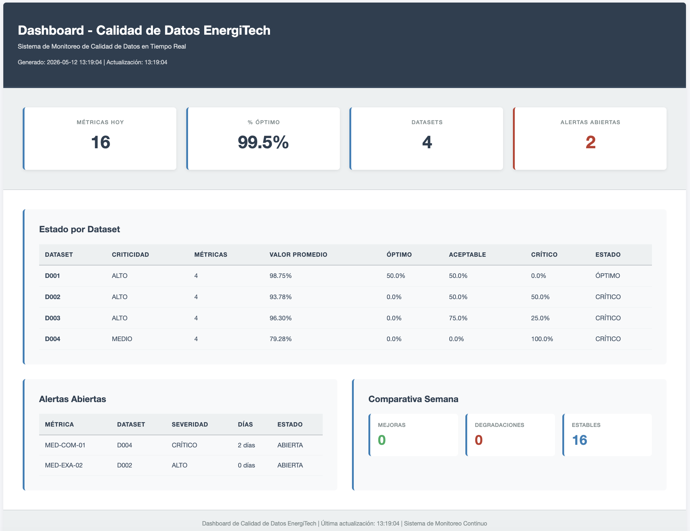
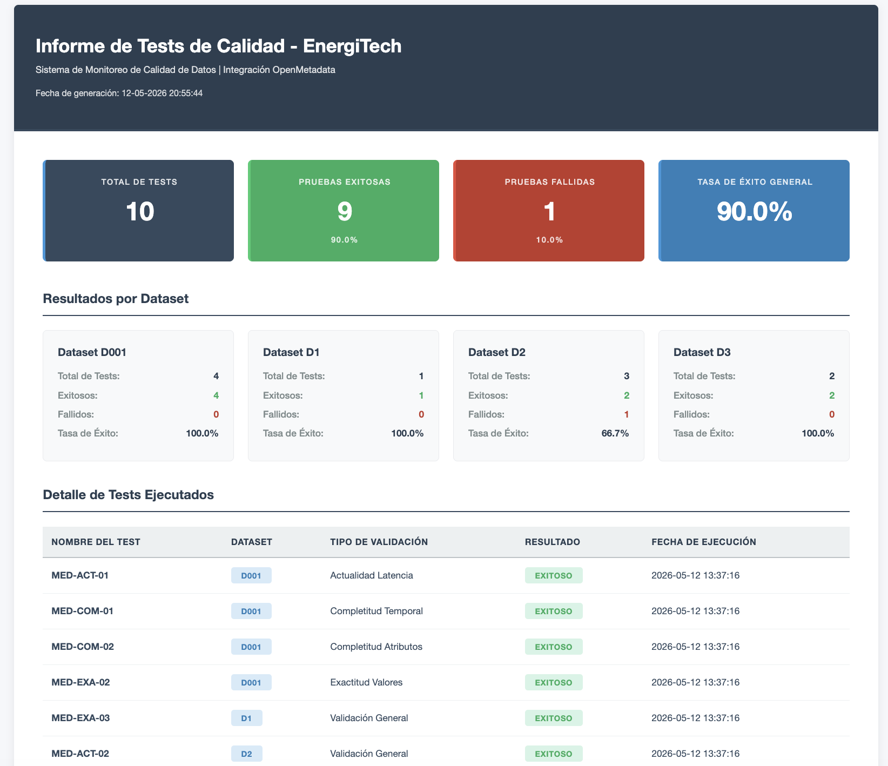
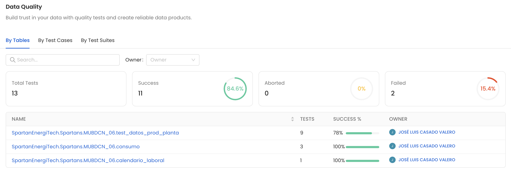
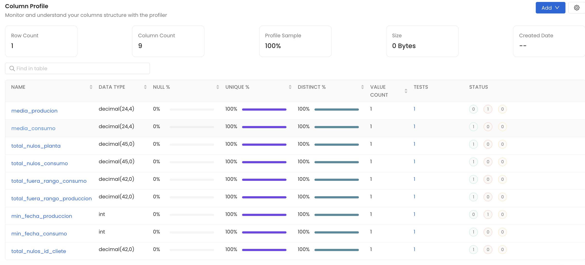
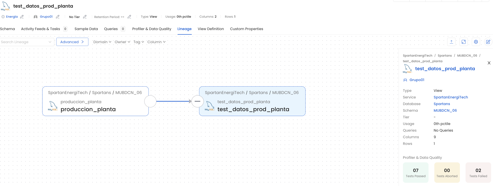
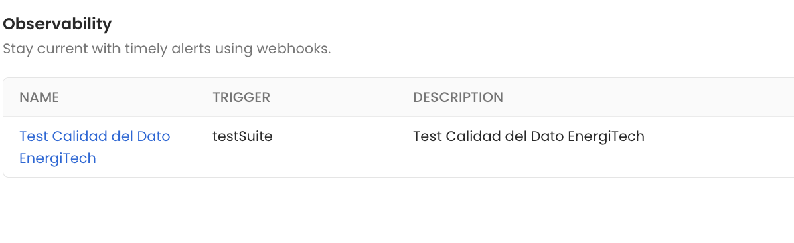

# Proyecto 5: Control y Monitorización de Calidad del Dato

## 1. Introducción y Contexto

Tras haber definido un modelo de calidad del dato con características medibles, métodos de medición, métricas y umbrales, afrontamos la fase operativa de **control y monitorización continua** de la calidad del dato.

---

## 2. Procedimientos de Medición de Calidad del Dato

Los procedimientos de medición garantizan que las métricas de calidad se calculan de forma **consistente, reproducible y automatizada**.

---

### 2.1 Catálogo de Procedimientos de Medición

#### 2.1.1 Procedimiento PRC-COM-01: Medición de Completitud Temporal

**Identificador:** `PRC-COM-01`  
**Objetivo:** Asegurar que se reciben el 100% de registros esperados en cada ventana temporal.  
**Ámbito:** Datasets D001 (Consumo Cliente), D002 (Producción Planta), D004 (Datos Climáticos)  
**Métrica Asociada:** MED-COM-01 (Tasa de Completitud Temporal)  

**Fuentes de Datos:**
- D001: Tabla `consumo` 
- D002: Tabla `produccion_planta`
- D004: Tabla `datos_climaticos`

**Frecuencia:** Diariamente + en tiempo real cada 30 minutos durante operación

**Herramientas:** 
- SQL + Apache Spark para cálculo batch
- OpenMetadata para catalogación de resultados

**Cálculo:**

```
Registros Esperados = Período (horas) / Intervalo de frecuencia (min) * 60
Registros Recibidos = COUNT(*) de la tabla en el período
Tasa de Completitud (%) = (Registros Recibidos / Registros Esperados) * 100
```

**Umbrales:**

| Dataset | Óptimo | Aceptable | Crítico | Acción |
|---------|--------|-----------|---------|--------|
| D001, D002 | ≥ 99% | 95-99% | < 95% | Crítico: Bloquear ingestión; Aceptable: Investigar causa |
| D004 | ≥ 95% | 90-95% | < 90% | Crítico: Bloquear ingestión |

**Salida / Reporte:**
- Tabla `metricas_calidad_datos`  con registro histórico
- Publicación automática en cuadro de mandos

**Notificación:**
- Crítico: Email inmediato a Propietarios de Datos + Gestor de Incidencias
- Aceptable: Registro en log; incluir en reporte semanal

**Revisión:** Trimestral

---

#### 2.1.2 Procedimiento PRC-COM-02: Medición de Completitud de Atributos

**Identificador:** `PRC-COM-02`  
**Objetivo:** Validar que ningún registro contiene campos NULL en atributos críticos.  
**Ámbito:** D001, D002, D003, D004  

**Métrica Asociada:** MED-COM-02 (Tasa de Completitud de Atributos)

**Frecuencia:** Diariamente + en tiempo real (cada 6 horas)

**Herramientas:** SQL (validaciones de datos)

**Diccionario de Campos Críticos:**

| Dataset | Campos Críticos |
|---------|-----------------|
| D001 | id_contador, marca_tiempo, consumo_kwh, id_zona |
| D002 | id_planta, marca_tiempo, produccion_kwh, tipo_energia |
| D003 | id_cliente, nombre_legal, latitud_ubicacion, longitud_ubicacion, id_contrato |
| D004 | id_estacion, marca_tiempo, temperatura, humedad |

**Umbrales:**

| Dataset | Óptimo | Aceptable | Crítico |
|---------|--------|-----------|---------|
| D001-D004 | 100% | 99-100% | < 99% |

**Cálculo:**

```
Por cada dataset y período:
  Total registros = N° total de registros
  Registros con algun NULL = En contador o marca de tiempo
  Tasa (%) = (total_records - null_count) / total_records * 100
```

**Notificación:** Si Tasa < 99%, bloquear transformación downstream; escalar a Propietario de Datos

---

#### 2.1.3 Procedimiento PRC-EXA-01: Medición de Exactitud

**Identificador:** `PRC-EXA-01`  
**Objetivo:** Detectar desviaciones sistemáticas en valores medidos vs. valores esperados.  
**Ámbito:** D001 (Consumo), D002 (Producción)  

**Métrica Asociada:** MED-EXA-01 (Desviación de Exactitud)

**Frecuencia:** Semanal 

**Herramientas:** SQL + Python (análisis estadístico) + OpenMetadata (linaje de datos)

**Cálculo - Consumo (D001):**

```
Para cada zona y semana:
  Consumo Reportado = SUM(consumo_kwh) de contadores
  Consumo Esperado = Estimado mediante modelo de regresión basado en histórico de 24 meses
  Desviación (%) = ABS(Consumo Reportado - Consumo Esperado) / Consumo Esperado * 100
```

**Cálculo - Producción (D002):**

```
Para cada planta y semana:
  Producción Reportada = SUM(produccion_kwh) de sensores SCADA
  Producción Esperada = Capac. Nominal * Factor de eficiencia esperado
  Desviación (%) = ABS(Prod. Reportada - Prod. Esperada) / Prod. Esperada * 100
```

**Umbrales:**

| Dataset | Umbral Aceptable | Umbral Crítico | Acción |
|---------|-----------------|----------------|--------|
| D001 Consumo | ± 2% | > ± 3% | Crítico: Investigar fuente de error |
| D002 Producción | ± 3% | > ± 5% | Crítico: Inspección técnica de sensor |

**Salida:** 
- Reporte semanal con desviaciones
- Flag automático en cuadro de mandos

**Notificación:** Si desviación > umbral crítico → Ingeniero de Mantenimiento + Analista de Datos

---

#### 2.1.4 Procedimiento PRC-ACT-01: Medición de Actualidad

**Identificador:** `PRC-ACT-01`  
**Objetivo:** Monitorear la latencia de llegada de datos vs. marca de tiempo de captura.  
**Ámbito:** D001, D002, D004  

**Métrica Asociada:** MED-ACT-01 (Latencia de Datos)

**Frecuencia:** Real-time (cada 5 minutos)

**Herramientas:** SQL + OpenMetadata

**Cálculo:**

```
Para cada mensaje recibido:
  Marca Temporal de Captura = timestamp en dato (cuando se midió)
  Marca Temporal de Ingesta = timestamp del sistema (cuando llegó)
  Latencia (minutos) = (Ingesta - Captura) en minutos
```

**Umbrales:**

| Dataset | Latencia Máxima Aceptable | Latencia Crítica | Acción |
|---------|---------------------------|------------------|--------|
| D001 Consumo | 30 minutos | > 60 min | Bloquear modelo; escalar a Ops |
| D002 Producción | 15 minutos | > 30 min | Escalar a Gestor SCADA |
| D004 Clima | 60 minutos | > 120 min | Usar datos históricos |

**Notificación:** Si hay Latencia Crítica envío de email.

---

## 3. Cuadro de Mandos de Monitorización de Calidad

**Objetivo Principal:** Proporcionar visibilidad **en tiempo real** del estado de calidad de los datos, permitiendo identificación rápida de incidencias y toma de decisiones operativas.

---

### 3.2 Especificación de Dashboards

Definiremos diferentres Dashboards en función del rol al que van destinados los datos.

#### 3.2.1 Dashboard 1: Resumen Ejecutivo

**Visualizaciones:**

| Visualización | Descripción | Actualización |
|---------------|-------------|---------------|
| **Calidad Global** | Indicador tipo semáforo (Rojo/Amarillo/Verde) mostrando score promedio ponderado de todos los datasets | En tiempo real |
| **Datasets en Riesgo** | Datasets con peor score; mostrar causa principal (Completitud/Exactitud/Actualidad) | Cada 6 horas |
| **Incidencias Abiertas** | Número de incidencias activas, desglosadas por severidad (Crítica/Alta/Media) | En tiempo real |
| **Tendencia 30 días** | Evolución del score de calidad global últimos 30 días; mostrar si mejora o degrada | Diaria |
| **Matriz Riesgo-Impacto** | Datasets mapeados por: Riesgo de Calidad (bajo/alto) vs. Impacto Negocio (bajo/alto) | Semanal |

**Artefacto Disponible:** 
[Ver Dashboard en tiempo real](../auxiliares/dashboard/dashboard-calidad-datos.html)

<div align="center">



</div>

**Descripción:** Este dashboard proporciona la visión ejecutiva de 
calidad de datos con indicadores de estado, datasets en riesgo, 
incidencias abiertas y tendencias. Actualización: cada 6 horas.

---

#### 3.2.2 Dashboard 2: Monitorización Operativa

**Visualizaciones:**

| Visualización | Descripción | Actualización |
|---------------|-------------|---------------|
| **Alertas en Tiempo Real** | Tabla ordenada por timestamp: Alert ID, Severidad, Dataset, Característica, Valor, Threshold, Acción | En tiempo real |
| **Completitud por Dataset** | Mostrar % completitud + límites óptimo/aceptable/crítico | Cada 2 horas |
| **Exactitud: Desviaciones** | X=Dataset; Y=% Desviación; colorear por severidad; mostrar tendencia líneal | Semanal |
| **Latencia: Percentiles** | Para cada dataset, mostrar: p50, p75, p95, p99 de latencia; línea de umbral crítico | Cada 30 min |
| **Estado de Jobs** | Última ejecución de cada procedimiento (PRC-COM-01, etc.); mostrar: Hora inicio, duración, estatus (OK/FAIL), mensajes error | En tiempo real |
| **Causas Raíz de Alertas** | Categorización de incidencias: Fuente mala / Error proceso / Retraso transmisión / Otra; conteo por categoría | Diaria |

**Artefacto Disponible:**
[Ver Tests de Calidad Ejecutados](../auxiliares/dashboard/tests-openmetadata.html)

<div align="center">



</div>

**Descripción:** Informe detallado de todos los tests de calidad 
ejecutados por cada dataset (D001, D002, D003, D004). Muestra:
- Tasa de éxito por dataset
- Detalle de cada test (nombre, resultado, timestamp)

---

#### 3.2.3 Dashboard 3: Integración con OpenMetadata

**Visualizaciones:**

| Visualización | Descripción | Actualización |
|---------------|-------------|---------------|
| **Catálogo Enriquecido** | Lista de datasets con: Nombre, Owner, Score Calidad, Última alerta, Linaje (datasets upstream/downstream) | Cada 12 horas |
| **Linaje de Datos + Calidad** | Diagrama de flujo de datos con coloreo por score de calidad; si dataset D001 baja, ver impacto en D009 (predicción) | Cada 6 horas |
| **Histórico de Cambios** | Para cada dataset: cuándo cambió el score, de qué a qué, cuál fue la causa, qué acción se tomó | Manual + automatizado |
| **Matriz de Dependencias** | Filas=Datasets consumidores; Columnas=Datasets proveedores; celda=severidad de impacto si proveedor falla | Mensual |


**Otros Artefactos Disponibles:**

Integración nativa con **OpenMetadata 1.4.3** para enriquecimiento automático de metadatos y trazabilidad de calidad:

- **Test de Calidad del Dato**

Suite de pruebas automatizadas definidas en OpenMetadata que validan características de completitud, exactitud y actualidad.

<div align="center">



</div>

- **Análisis de Datos (Column Profiling)**

Perfilado automático de columnas que identifica distribuciones, valores outliers, cardinalidad y patrones de datos. Facilita detección de anomalías y cambios en características estadísticas de datasets.

<div align="center">



</div>

- **Linaje de Datos (Data Lineage)**

Trazabilidad completa del flujo de datos desde fuentes originales hasta consumidores finales. Permite visualizar dependencias entre datasets y evaluar impacto de cambios de calidad en cadena de transformación.

<div align="center">



</div>

- **Alertas de Calidad del Dato**

Sistema de alertas en tiempo real que notifica desviaciones. Integrado con OpenMetadata para propagar eventos de degradación a todos los stakeholders interesados.

<div align="center">



</div>